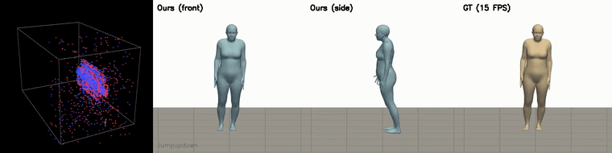
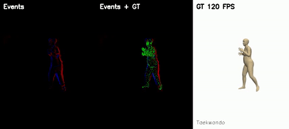
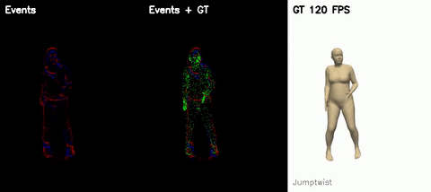
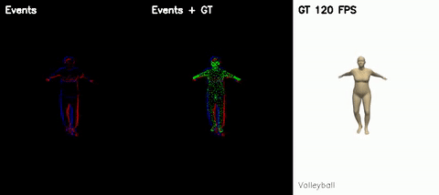
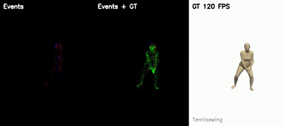

<h1 align="center">EvHuman: Continuous-Time Human Motion Field from Event Cameras</h1>

<p align="center">
  <b>
    <a href="https://ziyunclaudewang.github.io/">Ziyun Wang</a><sup>1,2</sup>,
    Ruijun Zhang<sup>1</sup>,
    Zi-Yan Liu<sup>1</sup>,
    Yufu Wang<sup>1</sup>,
    <a href="https://www.cis.upenn.edu/~kostas/">Kostas Daniilidis</a><sup>1,3</sup>
  </b>
</p>

<p align="center">
  <sup>1</sup>University of Pennsylvania &nbsp;&nbsp;
  <sup>2</sup>Johns Hopkins University &nbsp;&nbsp;
  <sup>3</sup>Archimedes, Athena RC
</p>

<p align="center"><b>ICCV 2025</b></p>

<p align="center">
  [<a href="https://ziyunclaudewang.github.io/evhuman/">Project page</a>]
  [<a href="https://openaccess.thecvf.com/content/ICCV2025/papers/Wang_Continuous-Time_Human_Motion_Field_from_Event_Cameras_ICCV_2025_paper.pdf">Paper (CVF)</a>]
  [<a href="https://arxiv.org/abs/2412.01747">arXiv</a>]
  [<a href="https://livejohnshopkins-my.sharepoint.com/:f:/g/personal/rzhan158_jh_edu/IgAP4D4DzZYoTJ1nbbJrqvTCATHoAYaZTykNFQU4tju3jmU?e=CGuXpT">BEAHM dataset</a>]
</p>

<p align="center">
  
  <br>
  <em>Top: the raw event stream as a 3D space-time (x, y, t) cloud. Bottom:
  the same latent code from one forward pass, queried at 15, 120, and 240
  FPS, next to the 15 FPS ground-truth labels (8&times; slow motion). More
  timestamps, smoother motion — nothing is interpolated or retrained. Full
  clip: <a href="assets/fps_ladder.mp4">assets/fps_ladder.mp4</a>.</em>
</p>

We estimate a continuous-time human motion field directly from a stream of
events. A recurrent feed-forward network predicts human motion in the latent
space of a neural motion field (NeMF), replacing discrete-time predictions
with a time-implicit function that can be queried in parallel at arbitrary
temporal resolutions. We also introduce the Beam-splitter Event Agile Human
Motion Dataset (BEAHM) — a hardware-synchronized, high-speed human dataset
with 120 FPS ground-truth meshes. Our method improves joint errors by 23.8%
over prior event-based methods while reducing computation by 69%.

## What's included

- **Training** — the full 4-stage pipeline: GMP pre-training, event encoder +
  NeMF latent prediction, GMP fine-tuning, joint fine-tuning
  (`train_gmp.py`, `train_eventhpe.py`)
- **Evaluation** — MMHPSD and BEAHM protocols, including 120 FPS
  continuous-time evaluation (`test_eventhpe.py`)
- **Pretrained checkpoints** — MMHPSD, BEAHM, and the AMASS pre-trained NeMF
  decoder ([v1.0 release](https://github.com/ZiyunClaudeWang/evhuman/releases/tag/v1.0))
- **Visualization** — continuous-time demo renderer with a 3D space-time
  event cloud and ground-truth comparison (`render_demo_video.py`)
- **Contrast maximization** — event-based self-supervised refinement
  ([`contrast_maximization/`](contrast_maximization/))

## Checklist

- [x] ~~**MMHPSD training & evaluation** — reproduces the paper protocol~~
- [x] ~~**BEAHM training & evaluation** — 15 FPS and 120 FPS protocols~~
- [x] ~~**Pretrained checkpoints** — MMHPSD, BEAHM, NeMF decoder (v1.0 release)~~
- [x] ~~**Continuous-time demo rendering** — 3D (x, y, t) event cloud, slow motion, GT panel~~
- [x] ~~**Contrast maximization module** — per-sequence self-supervised refinement~~

## Results

Metrics of the released checkpoints.

| Dataset | MPJPE | PA-MPJPE | PEL-MPJPE | PCKh@0.5 |
|:---:|:---:|:---:|:---:|:---:|
| MMHPSD | 65.89 | 39.03 | 49.95 | 0.862 |
| BEAHM | 48.32 | 30.08 | 41.08 | 0.915 |

<p align="center">
  
  <br>
  <em>Qualitative human mesh recovery results from event streams.</em>
</p>

## Demo

The teaser above is produced by `render_fps_ladder.py`: the same clip is
decoded from one latent code at 15, 120, and 240 FPS, so the 15 FPS panel
visibly steps while 240 FPS is smooth — the motion field is simply queried
at more timestamps.

```bash
PYTHONPATH=NeMF/src:$PYTHONPATH python render_fps_ladder.py \
    --data_root data/beahm \
    --event_folder data/beahm_events/ \
    --model_dir ckpts/beahm/model_events_pose.pkl \
    --our_data --skip 8 --target_action Jumpupdown --num_clips 2
```

<p align="center">
  
  <br>
  <em>Left to right: raw events as a 3D space-time (x, y, t) cloud, our
  prediction from the front and side, and the ground truth. Full nine-action
  compilation: <a href="assets/demo.mp4">assets/demo.mp4</a>.</em>
</p>

`render_demo_video.py` stitches consecutive clips of each test action into a
continuous sequence. Because the motion field is continuous in time, each clip
is decoded at an arbitrary number of timestamps (`--frames_per_clip`) rather
than only at the labelled keyframes, so the result is genuine slow motion
rather than interpolated frames. The raw event stream is binned into the same
timestamps using its microsecond timestamps, so the event cloud advances in
lockstep with the mesh.

```bash
PYTHONPATH=NeMF/src:$PYTHONPATH python render_demo_video.py \
    --data_root data/beahm \
    --event_folder data/beahm_events/ \
    --model_dir ckpts/beahm/model_events_pose.pkl \
    --our_data --skip 8 \
    --fps 30 --num_clips 3 --frames_per_clip 32 --resolution 380
```

Clips are stepped by `clip_len * skip` source frames so the stitched motion is
contiguous. The camera is fixed per action and a ground plane is drawn at the
measured floor height, so global translation stays visible. Pass `--show_gt`
(on by default) to render the ground-truth panel under the same camera for
direct comparison.

## The BEAHM dataset

BEAHM (Beam-splitter Event Agile Human Motion) is captured with a
hardware-synchronized rig: an event camera and a frame camera share one
optical axis through a beam splitter, and SMPL ground truth is fit by
multi-view optimization over four additional synchronized cameras, at a
true 120 FPS (8,000 &micro;s between labels). Beyond the basic
training/test motions, the release includes an *extreme* subset — martial
arts, jumps with full twists, ball sports — at speeds where frame cameras
blur. Below, left to right: raw events, the GT mesh vertices projected
onto the events (exact calibration chain, lens distortion included), and
the 120 FPS ground truth seen from the event camera, 4&times; slow motion:

| | |
|:---:|:---:|
|  |  |
|  |  |

Each released H5 is self-contained: raw events (x, y, t, p), 120 FPS SMPL
annotations (pose, shape, root R/T in the event-camera frame), calibration,
and synchronized frames. These clips render straight from the H5 files:

```bash
PYTHONPATH=NeMF/src:$PYTHONPATH python render_beahm_gallery.py \
    --h5_dir data/beahm_h5/extreme --save_folder outputs/beahm_gallery
```

Download: [BEAHM (OneDrive)](https://livejohnshopkins-my.sharepoint.com/:f:/g/personal/rzhan158_jh_edu/IgAP4D4DzZYoTJ1nbbJrqvTCATHoAYaZTykNFQU4tju3jmU?e=CGuXpT).

## Install

```bash
conda create -n evhuman python=3.10
conda activate evhuman
pip install torch torchvision --index-url https://download.pytorch.org/whl/cu118
pip install -r requirements.txt

# chumpy (SMPL loader) has a legacy setup.py that needs the env's pip
pip install --no-build-isolation chumpy

# nvdiffrast compiles a CUDA extension: it needs the CUDA toolkit (nvcc)
# and must see the installed torch at build time
conda install -c nvidia/label/cuda-11.8.0 cuda-toolkit
CUDA_HOME=$CONDA_PREFIX pip install --no-build-isolation \
    git+https://github.com/NVlabs/nvdiffrast.git
```

This exact sequence is verified end to end in a fresh environment: every
entry point imports, the SMPL model loads, and nvdiffrast compiles and
rasterizes on GPU.

### Tested on

| Component | Version |
|:---|:---|
| OS | Ubuntu 22.04 LTS (kernel 6.8) |
| NVIDIA driver | 580.173 |
| CUDA toolkit | 11.8 (conda, for the nvdiffrast build) |
| Python | 3.10 |
| PyTorch | 2.2.2 (development) and 2.7.1+cu118 (fresh install) |
| numpy | 1.23 |
| OpenCV (contrib) | 4.5.5 |

## Pretrained weights

| File | Contents |
|:---|:---|
| [`mmhpsd_model.pkl`](https://github.com/ZiyunClaudeWang/evhuman/releases/tag/v1.0) | Full model trained on MMHPSD |
| [`beahm_model.pkl`](https://github.com/ZiyunClaudeWang/evhuman/releases/tag/v1.0) | Full model trained on BEAHM |
| [`nemf_decoder.pkl`](https://github.com/ZiyunClaudeWang/evhuman/releases/tag/v1.0) | NeMF decoder pre-trained on AMASS |

Place the full models under `ckpts/` and the NeMF decoder under
`NeMF/outputs/generative/results/model/`.

## Data

### MMHPSD

Download the MMHPSD dataset from [EventHPE](https://github.com/JimmyZou/EventHPE)
and place it under `data/mmhpsd/`, with event data under `data/mmhpsd_events/`.

### BEAHM

Download the Beam-splitter Event Agile Human Motion Dataset here:
[**BEAHM download (OneDrive)**](https://livejohnshopkins-my.sharepoint.com/:f:/g/personal/rzhan158_jh_edu/IgAP4D4DzZYoTJ1nbbJrqvTCATHoAYaZTykNFQU4tju3jmU?e=CGuXpT)
(also linked from the [project page](https://ziyunclaudewang.github.io/evhuman/)).
The release ships self-contained H5 files. Note that OneDrive's
"download folder as zip" silently drops files beyond its ~20 GB limit and
leaves `*_Error.txt` stubs in the archive — download in a few smaller
batches and check that `basic/` contains all 139 sequences. Place them
under `data/beahm_h5/{basic,extreme}`, then convert to the processed
layout the training code consumes:

```bash
PYTHONPATH=NeMF/src:$PYTHONPATH python script/preprocess_beahm.py \
    --h5_dir data/beahm_h5/basic --out_dir data/beahm --num_workers 6
```

Preprocessing needs the smplx-packaged neutral model `SMPL_NEUTRAL.pkl`
(from [SMPL](https://smpl.is.tue.mpg.de/), same account as below) at
`data/smpl/SMPL_NEUTRAL.pkl` — the ground truth was fit with it. In the
training and evaluation commands, `--data_root` is the preprocessing
output (`data/beahm`) and `--event_folder` is the raw H5 directory
(`data/beahm_h5/basic/`). The conversion is verified bit-equivalent to the
original release pipeline, and evaluation on converted data matches the
reference to five decimals.

### Pre-processing

Convert raw events into event volume images:

```bash
python script/convert_volumes.py --event_folder data/mmhpsd_events --save_folder data/mmhpsd_volumes
```

### SMPL model

Download the SMPL model from [SMPL](https://smpl.is.tue.mpg.de/) and place
`basicModel_m_lbs_10_207_0_v1.0.0.pkl` and
`basicModel_neutral_lbs_10_207_0_v1.0.0.pkl` in `event_hpe/smpl_model/`.

## Training

All commands require the `PYTHONPATH=NeMF/src:$PYTHONPATH` prefix. Training
follows four stages.

### Stage 1: GMP on GT poses

```bash
PYTHONPATH=NeMF/src:$PYTHONPATH python train_gmp.py \
    --data_root data/mmhpsd \
    --event_folder data/mmhpsd_events/ \
    --result_dir outputs \
    --log_dir gmp_stage1 \
    --batch_size 8 --epochs 10
```

### Stage 2: Event encoder + NeMF latent prediction

```bash
PYTHONPATH=NeMF/src:$PYTHONPATH python train_eventhpe.py \
    --data_root data/mmhpsd \
    --event_folder data/mmhpsd_events/ \
    --result_dir outputs \
    --log_dir stage2 \
    --batch_size 8 --epochs 10 \
    --gmp_model_path outputs/gmp_stage1/log/<timestamp>/model_events_pose.pkl
```

### Stage 3: GMP fine-tuning on predicted poses

```bash
PYTHONPATH=NeMF/src:$PYTHONPATH python train_eventhpe.py \
    --data_root data/mmhpsd \
    --event_folder data/mmhpsd_events/ \
    --result_dir outputs \
    --log_dir gmp_finetune \
    --model_dir outputs/stage2/log/<timestamp>/model_events_pose.pkl \
    --only_train_gmp --finetune_gmp --reset_optimizer \
    --batch_size 16 --epochs 1 --lr_start 0.0002
```

### Stage 4: Joint fine-tuning

```bash
PYTHONPATH=NeMF/src:$PYTHONPATH python train_eventhpe.py \
    --data_root data/mmhpsd \
    --event_folder data/mmhpsd_events/ \
    --result_dir outputs \
    --log_dir joint_finetune \
    --model_dir outputs/gmp_finetune/log/<timestamp>/model_events_pose.pkl \
    --finetune_gmp --reset_optimizer \
    --batch_size 32 --epochs 1 --lr_start 0.0001
```

### BEAHM

For BEAHM, add `--our_data`, set `--skip 8`, and disable flow loss. The same
four stages apply:

```bash
# Stage 2: Event encoder (BEAHM)
PYTHONPATH=NeMF/src:$PYTHONPATH python train_eventhpe.py \
    --data_root data/beahm \
    --event_folder data/beahm_events/ \
    --result_dir outputs --log_dir beahm_stage2 \
    --our_data \
    --flow_loss 0 --skip 8 \
    --batch_size 8 --epochs 10

# Stage 3: GMP fine-tune (BEAHM)
PYTHONPATH=NeMF/src:$PYTHONPATH python train_eventhpe.py \
    --data_root data/beahm \
    --event_folder data/beahm_events/ \
    --result_dir outputs --log_dir beahm_gmp \
    --model_dir outputs/beahm_stage2/log/<timestamp>/model_events_pose.pkl \
    --only_train_gmp --finetune_gmp --reset_optimizer --our_data \
    --flow_loss 0 --skip 8 \
    --batch_size 16 --epochs 1 --lr_start 0.0002

# Stage 4: Joint fine-tune (BEAHM)
PYTHONPATH=NeMF/src:$PYTHONPATH python train_eventhpe.py \
    --data_root data/beahm \
    --event_folder data/beahm_events/ \
    --result_dir outputs --log_dir beahm_joint \
    --model_dir outputs/beahm_gmp/log/<timestamp>/model_events_pose.pkl \
    --finetune_gmp --reset_optimizer --our_data \
    --flow_loss 0 --skip 8 \
    --batch_size 16 --epochs 1 --lr_start 0.0001
```

### Contrast maximization

The event-based contrast maximization loss (Sec. 4.4) provides a
self-supervised training signal by maximizing the sharpness of the Image of
Warped Events. See [`contrast_maximization/`](contrast_maximization/) for
documentation, implementation variants, and per-sequence optimization results.

## Evaluation

### MMHPSD

```bash
PYTHONPATH=NeMF/src:$PYTHONPATH python test_eventhpe.py \
    --data_root data/mmhpsd \
    --event_folder data/mmhpsd_events/ \
    --model_dir ckpts/mmhpsd/model_events_pose.pkl
```

### BEAHM at 15 FPS

```bash
PYTHONPATH=NeMF/src:$PYTHONPATH python test_eventhpe.py \
    --data_root data/beahm \
    --event_folder data/beahm_events/ \
    --model_dir ckpts/beahm/model_events_pose.pkl \
    --our_data --skip 8
```

### BEAHM at 120 FPS

```bash
PYTHONPATH=NeMF/src:$PYTHONPATH python test_eventhpe.py \
    --data_root data/beahm \
    --event_folder data/beahm_events/ \
    --model_dir ckpts/beahm/model_events_pose.pkl \
    --our_data --test_high_fps --skip 8
```

## Visualization

### Multi-view video

```bash
PYTHONPATH=NeMF/src:$PYTHONPATH python render_video_with_events.py \
    --data_root data/mmhpsd \
    --event_folder data/mmhpsd_events/ \
    --model_dir ckpts/mmhpsd/model_events_pose.pkl \
    --fps 60 --sample_idx 300 --resolution 512
```

The output shows events (left), front view (center), and side view (right),
with the continuous-time decoder sampled at the target FPS.

### Mesh overlays

```bash
PYTHONPATH=NeMF/src:$PYTHONPATH python run_inference.py \
    --data_root data/mmhpsd \
    --event_folder data/mmhpsd_events/ \
    --model_dir ckpts/mmhpsd/model_events_pose.pkl \
    --inference_length 64 \
    --save_folder outputs/viz/
```

## Citation

```bibtex
@inproceedings{wang2025continuous,
    title={{Continuous-Time Human Motion Field from Events}},
    author={Wang, Ziyun and Zhang, Ruijun and Liu, Zi-Yan and Wang, Yufu and Daniilidis, Kostas},
    booktitle={International Conference on Computer Vision (ICCV)},
    year={2025}
}
```

## Acknowledgements

This work was supported by NSF FRR 2220868, NSF IIS-RI 2212433, ARO MURI
W911NF-20-1-0080, and ONR N00014-22-1-2677. The NeMF decoder is based on
[NeMF](https://github.com/c-he/NeMF).
