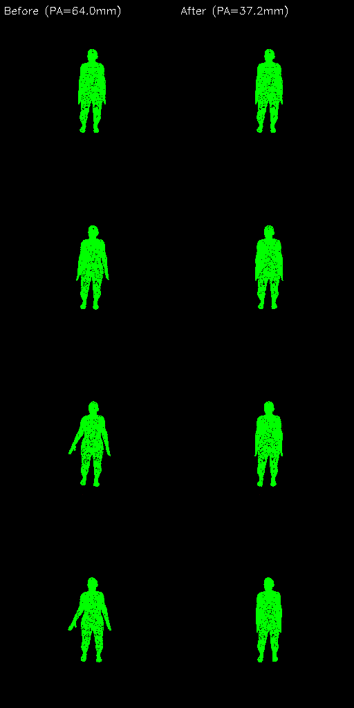
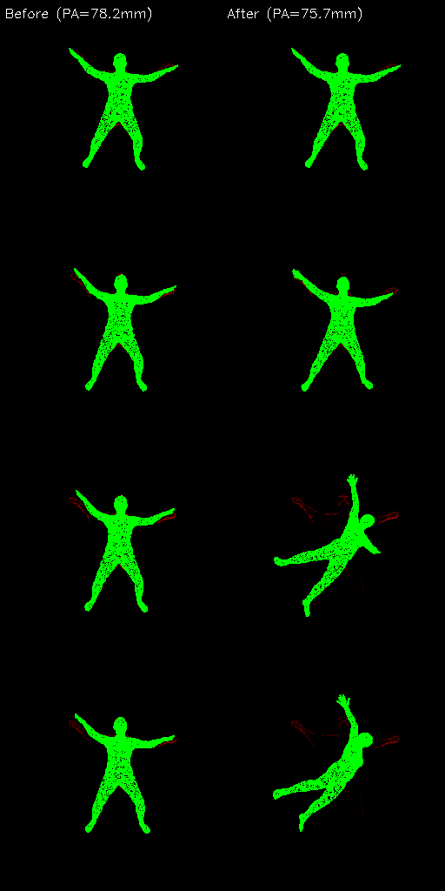

# Event Contrast Maximization for Human Pose Refinement

This module implements the event-based contrast maximization loss (Sec. 4.4 of the paper) for self-supervised human pose refinement using event camera data.

## Overview

The contrast maximization loss provides a self-supervised training signal by maximizing the sharpness of the Image of Warped Events (IWE). It warps raw events using the optical flow derived from the predicted SMPL mesh motion and measures how well the warped events align — sharper alignment indicates more accurate motion prediction.

This loss is most useful for **per-sequence test-time optimization** on clips where the feed-forward model produces poor predictions, without requiring any ground-truth labels.

## Results: Per-Sequence Contrast Optimization

Starting from a trained EvHuman model, we optimize individual test clips using only the contrast loss (no GT supervision). The contrast loss improves PA-MPJPE on clips where the model has high initial error:

<div align="center">

| Sequence | Before (mm) | After (mm) | Change |
|:---:|:---:|:---:|:---:|
| Jumpsideway | 64.0 | **37.2** | **−26.8** |
| Starjump | 78.2 | **57.0** | **−21.2** |

</div>

These are the hardest clips in the test set (PA-MPJPE > 60mm), where the feed-forward model struggles with fast, large-amplitude motions. The contrast loss adapts the predictions to match the observed events, reducing pose error by 21-27mm without any ground-truth labels.

### Visual Results

**Jumpsideway** (PA-MPJPE: 64.0 → 37.2mm): Green mesh edges overlaid on events (red/blue). Left: before, Right: after contrast optimization.

<p align="center">
  
</p>

**Starjump** (PA-MPJPE: 78.2 → 57.0mm):

<p align="center">
  
</p>

**Note:** On clips where the model already performs well (PA-MPJPE < 50mm), contrast optimization can degrade performance, as the contrast signal lacks sufficient anatomical constraints to preserve already-correct poses. The loss is most effective as a refinement tool for failure cases.

## Usage

### Per-Sequence Optimization

```python
# Load trained model and a test clip with raw events
model = EventHumanModel(args)
load_checkpoint(model, 'ckpts/model.pkl')

# Optimize with contrast loss only (200 steps, LR=1e-5)
optimizer = torch.optim.Adam(model.parameters(), lr=1e-5)
for step in range(200):
    optimizer.zero_grad()
    out = model(batch)
    verts = out['verts']

    total_loss = 0
    for ref in range(verts.shape[1] - 1):
        flow, mask = model.compute_flow(
            verts[:, ref], verts[:, ref+1],
            faces, intrinsics, H, W, return_mask=True)
        events = get_events_for_frame(raw_events, event_breaks, ref)
        sharpness = model.compute_contrast_loss_v3(events, flow[0], mask[0])
        total_loss += sharpness

    loss = -0.1 * total_loss / num_terms
    loss.backward()
    optimizer.step()
```

### Training with Contrast Loss

Add `--contrast_loss 0.1` to training commands. Available variants:

```bash
# Original contrast loss (single frame pair, global IWE variance)
--contrast_loss 0.1

# Improved v2 (multi-pair, bbox-cropped, gradient sharpness)
--contrast_loss 0.01 --contrast_v2

# Inter-frame contrast (at intermediate 120fps timestamps)
--contrast_loss 0.01 --contrast_interp
```

## Implementation Details

### Contrast Loss Variants

1. **v1** (`compute_contrast` in `train_eventhpe.py`): Original formulation from the paper. Samples one random frame pair, computes global IWE variance.

2. **v2/v3** (`compute_contrast_v2`, `compute_contrast_loss_v3`): Improved version with:
   - Multiple frame pairs with varying temporal gaps (1, 2, 4 frames)
   - Bounding box cropping to the mesh silhouette region
   - Gradient-based sharpness (squared image gradient) + variance
   - 8-13x stronger gradient signal than v1

3. **Inter-frame** (`compute_contrast_interp`): Applies contrast at intermediate 120fps timestamps between the supervised 15fps keyframes, avoiding gradient conflict with supervised losses.

### Key Functions

- `EventHumanModel.compute_flow(v0, v1, faces, intrinsics, H, W, return_mask=True)`: Computes per-pixel optical flow from mesh vertex displacement via nvdiffrast rasterization. Returns flow [B, H, W, 2] and silhouette mask [B, H, W].

- `EventHumanModel.compute_IWE(events, flow, t_ref=1)`: Warps events using the predicted flow (constant velocity assumption) and accumulates into an Image of Warped Events via bilinear splatting.

- `EventHumanModel.compute_contrast_loss_v3(events, flow, mask)`: Crops IWE to mesh bounding box, computes squared gradient magnitude + variance as sharpness metric.

### Gradient Flow

The contrast loss gradient flows through:
1. IWE sharpness → warped event positions (via bilinear splatting weights)
2. → sampled flow at event locations (via `F.grid_sample`)
3. → per-pixel flow (via nvdiffrast `dr.interpolate`)
4. → 3D vertex positions (via perspective projection)
5. → SMPL forward kinematics → joint rotations → NeMF latent codes → encoder

## Limitations

- The constant velocity assumption in event warping limits accuracy for non-linear motions within each frame interval.
- The IWE variance/sharpness metric lacks anatomical constraints — it can achieve high sharpness by deforming the mesh to match event silhouettes without maintaining correct joint angles.
- On already well-trained models, the contrast signal is too weak relative to the supervised loss optimum to provide further improvement.
- The contrast loss is most effective for per-sequence test-time optimization on failure cases, not as a general training loss replacement.

## References

- Gallego, Gehrig, Scaramuzza. "Focus Is All You Need: Loss Functions For Event-based Vision." CVPR 2019.
- Hamann, Wang et al. "Motion-prior Contrast Maximization for Dense Continuous-time Motion Estimation." ECCV 2025.
